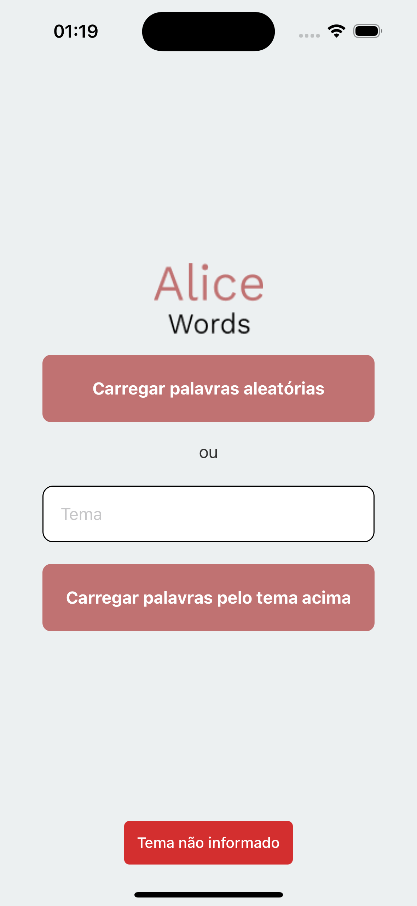
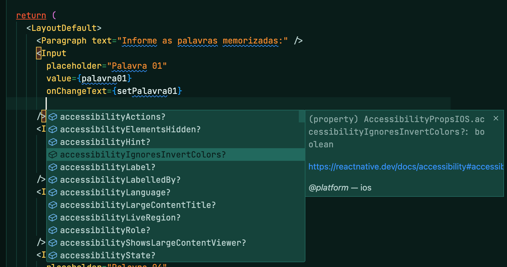

# Fiap - 7AOJR - Frontend Engineering - Trabalho 2

Monorepo com a [API de palavras aleatórias](./api/) e o [aplicativo nativo](./app/) com React Native.

## Setup

### API

1. Baixar dependências

```sh
npm install
```

2. Setar variáveis de ambiente

```sh
# no diretório da api
cp .env.template .env
```
Substituir com os valores. Sobre a key da OpenAI, será necessário ter um cartão de crédito cadastrado em **Billing**, e seguir essas etapas aqui [Where do I find my OpenAI API Key?
](https://help.openai.com/en/articles/4936850-where-do-i-find-my-openai-api-key)

3. Rodar API

```sh
npm start
```

### App

1. Baixar dependências

```sh
npm install
```
2. Setar variáveis de ambiente

```sh
# no diretório do app
cp .env.template .env.local
```

Substituir com os valores.

3. Rodar o App

```sh
npm start
```

## Melhorias

Em relação ao estágio em que o professor entregou a aplicação de base, as seguintes melhorias foram realizadas:

### AI ✨: Palavras por tema

Integrando com a OpenAi foi possível pedir para gerar palavras por assunto. Isso pode auxiliar no início da memorização


### Modo hard: desabilitando autocomplete e corretor ortográfico

Para exercitar melhor a memória, desabilitei a sugestão de palavras do teclado, tornando o jogo mais desafiador.


### Toast notifications

Para avisar o usuário de problemas no carregamento, incluí notificações toast



### Habilitando autocomplete e validação de tipagem básica

Com o uso do [jsconfig.json](https://code.visualstudio.com/docs/languages/jsconfig), foi possível habilitar suporte à tipagem estática de código básica, tornando a experiência de desenvolvimento mais assertiva:



### Uso em monorepo

A esteira foi modificada para suportar trabalhar em um monorepo. Dessa forma é mais fácil alterar arquivos entre API e App.